# StudyNotion

<p align="center">
  <strong>A Full-Stack Learning Management System (LMS)</strong><br>
  Built using the MERN Stack
</p>

<p align="center">


</p>

---

## Overview

StudyNotion is a full-stack Learning Management System (LMS) inspired by modern online education platforms. The application enables instructors to create, organize, and publish courses while allowing students to securely purchase, enroll in, and complete those courses through an intuitive learning interface.

Built using the MERN stack, the project demonstrates the implementation of modern web development practices including secure authentication, role-based authorization, cloud-based media management, online payment processing, and responsive user interfaces.

The application follows a client-server architecture where the React frontend communicates with an Express.js REST API, while MongoDB manages persistent application data. Third-party integrations such as Cloudinary and Razorpay provide scalable media storage and secure payment processing.

---

## Key Highlights

- Full-stack MERN application
- JWT-based authentication and authorization
- OTP-based email verification
- Role-Based Access Control (Student & Instructor)
- Course creation and management
- Secure online payments using Razorpay
- Cloud-based media storage with Cloudinary
- Student progress tracking
- Responsive user interface
- RESTful API architecture

---

## Live Demo

| Resource | URL |
|----------|-----|
| Frontend | https://study-notion-app-rho.vercel.app |
| Backend API | https://studynotion-backend-ojy2.onrender.com |
| Repository | https://github.com/ArshnoorSingh07/StudyNotion |

---

## Technology Stack

| Category | Technologies |
|-----------|--------------|
| Frontend | React.js, Redux Toolkit, React Router DOM, Tailwind CSS |
| Backend | Node.js, Express.js |
| Database | MongoDB, Mongoose |
| Authentication | JWT, Bcrypt |
| Media Storage | Cloudinary |
| Payment Gateway | Razorpay |
| Email Service | Nodemailer |
| Deployment | Vercel, Render |
| Version Control | Git, GitHub |
| API Testing | Postman |

---


## Features

StudyNotion provides a complete learning experience for both students and instructors through a role-based platform.

| Module | Functionality |
|----------|--------------|
| Authentication | User registration, login, OTP verification, password reset, JWT authentication |
| Student Dashboard | Browse courses, enroll in courses, watch lectures, track progress, manage profile |
| Instructor Dashboard | Create, edit, publish and manage courses, upload content, monitor enrolled students |
| Course Management | Categories, sections, subsections, thumbnails, video lectures and structured course content |
| Payments | Secure course purchases with Razorpay and automatic enrollment after payment verification |
| Media Management | Cloudinary integration for image and video uploads |
| Reviews | Students can submit ratings and reviews for enrolled courses |
| Security | Password hashing, protected routes, role-based authorization and server-side validation |

---

## System Architecture

StudyNotion follows a client-server architecture where the frontend communicates with the backend through REST APIs.

```text
                     +----------------------+
                     |    React Frontend    |
                     +----------+-----------+
                                |
                                | HTTPS / REST APIs
                                |
                     +----------v-----------+
                     | Express.js Backend   |
                     +----------+-----------+
                                |
          +---------------------+----------------------+
          |                     |                      |
          |                     |                      |
+---------v--------+   +--------v---------+   +--------v--------+
|     MongoDB      |   |   Cloudinary     |   |    Razorpay     |
| Application Data |   | Media Storage    |   | Payment Gateway |
+------------------+   +------------------+   +-----------------+
```

### Architecture Overview

- React provides the client-side user interface.
- Express.js exposes RESTful APIs for all application operations.
- MongoDB stores application data including users, courses and progress.
- Cloudinary manages course thumbnails and lecture videos.
- Razorpay processes secure online payments and enrollment.

---

## Project Structure

```text
StudyNotion
│
├── frontend
│   ├── public
│   ├── src
│   │   ├── assets
│   │   ├── components
│   │   ├── data
│   │   ├── hooks
│   │   ├── pages
│   │   ├── redux
│   │   ├── services
│   │   ├── utils
│   │   ├── App.jsx
│   │   └── main.jsx
│   │
│   └── package.json
│
├── server
│   ├── config
│   ├── controllers
│   ├── middleware
│   ├── models
│   ├── routes
│   ├── utils
│   ├── mail
│   ├── index.js
│   └── package.json
│
├── README.md
└── package.json
```

### Directory Overview

| Directory | Description |
|------------|-------------|
| `frontend/` | React application and user interface |
| `components/` | Reusable UI components |
| `pages/` | Route-level pages |
| `redux/` | Global state management |
| `services/` | API requests and service functions |
| `server/` | Express backend |
| `controllers/` | Business logic for API endpoints |
| `models/` | MongoDB schemas using Mongoose |
| `routes/` | REST API route definitions |
| `middleware/` | Authentication, authorization and request validation |
| `utils/` | Helper functions and reusable utilities |
| `mail/` | Email templates and mailing logic |

---

## Application Preview

The following screenshots highlight the core features and user experience of StudyNotion.

### Landing Page

The landing page introduces the platform, featured courses, categories, and key functionalities.


---

### User Registration

New users can create an account with email verification using OTP authentication.

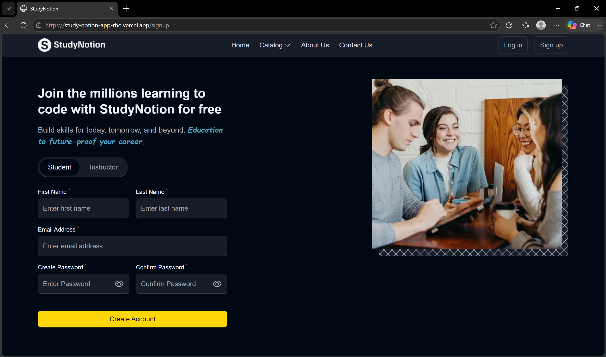

---

### User Login

Secure authentication using JWT-based login.

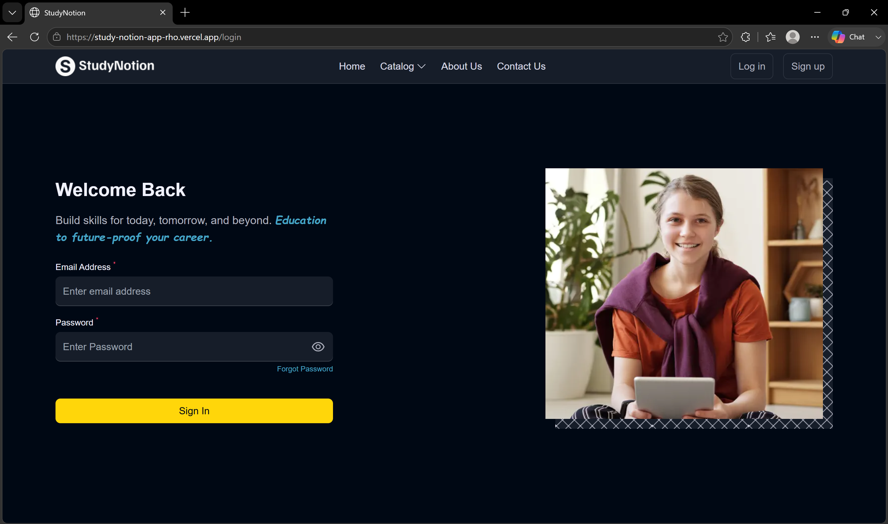

---

### Home Dashboard

Students can browse available courses, categories, and personalized content.

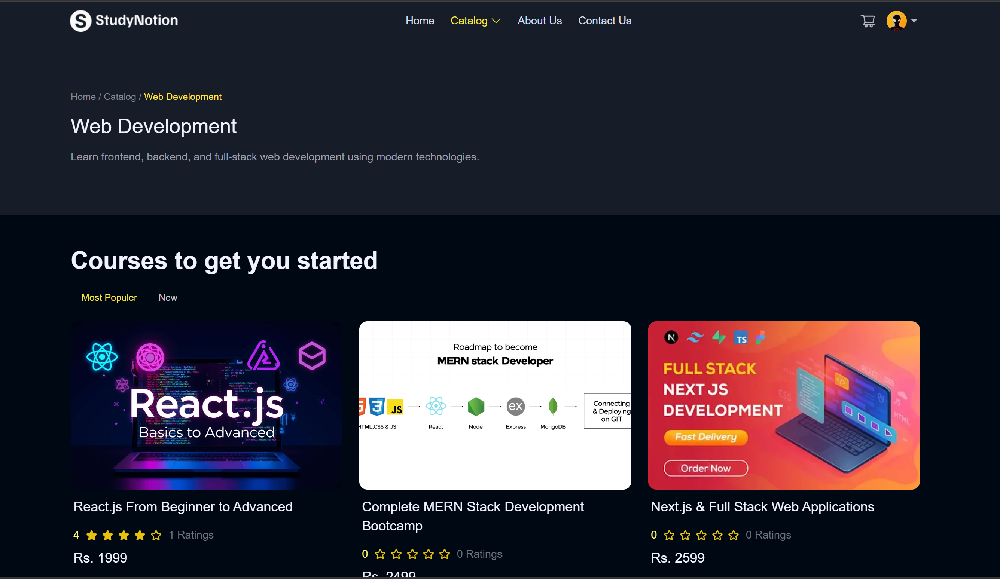

---

### Course Details

Detailed course information including instructor, curriculum, pricing, and reviews.

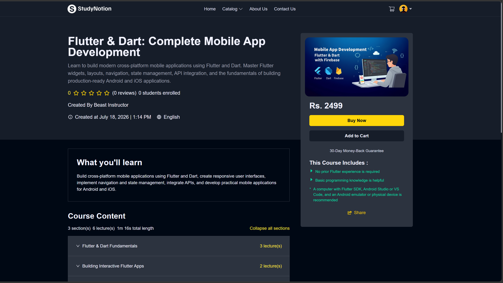

---

### Student Dashboard

Students can manage enrolled courses, learning progress, profile, and account settings.

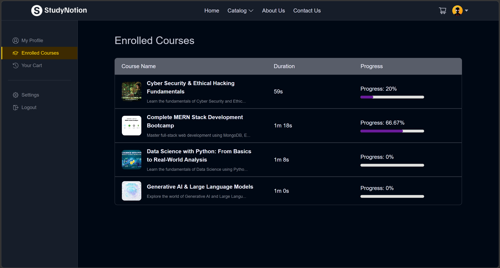

---

### Video Learning Experience

Interactive course player with lecture navigation and progress tracking.

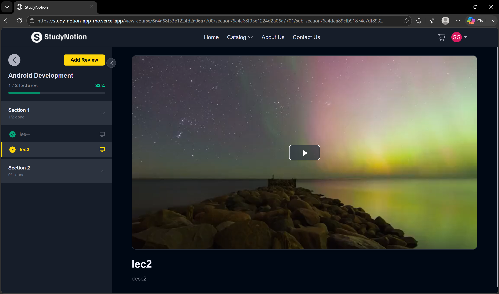

---

### Instructor Dashboard

Instructors can monitor published courses, enrolled students, and overall course performance.

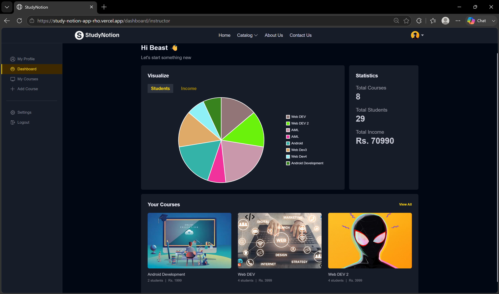

---

### Course Builder

A dedicated interface for creating and organizing courses with sections and lectures.

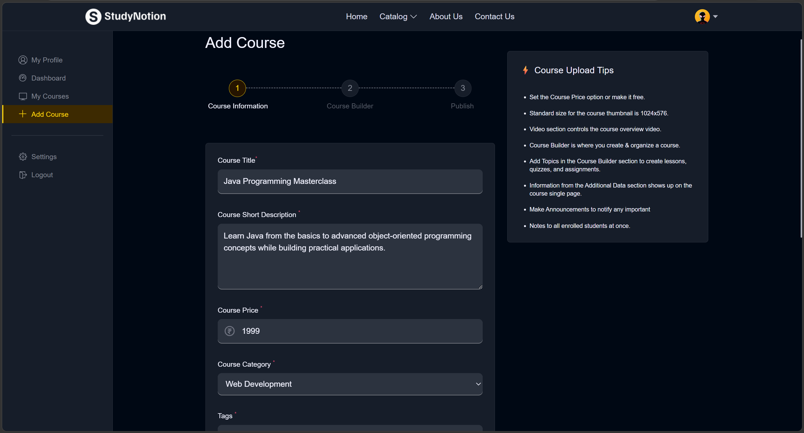

---

### Edit Course

Update course information, pricing, thumbnails, and publication status.

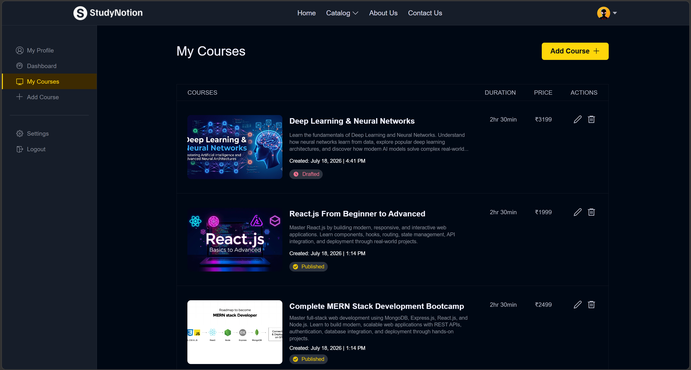
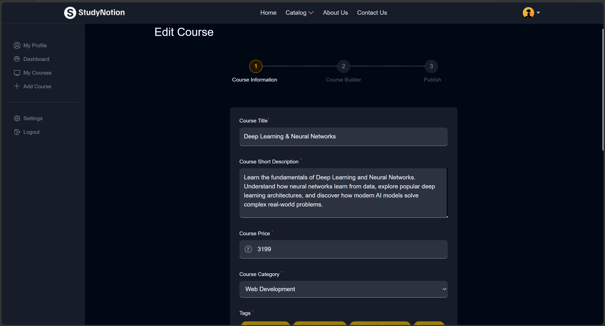

---

### Profile Management

Users can update personal information, profile picture, and account settings.

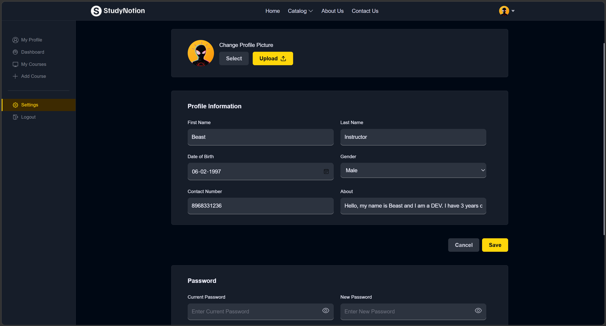

---

### Payment Integration

Secure checkout powered by Razorpay for seamless course enrollment.

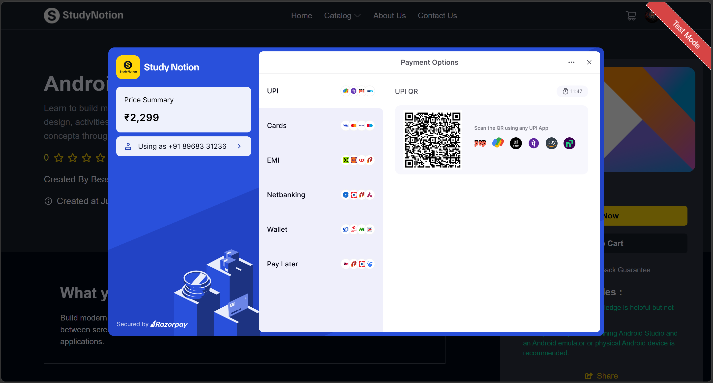
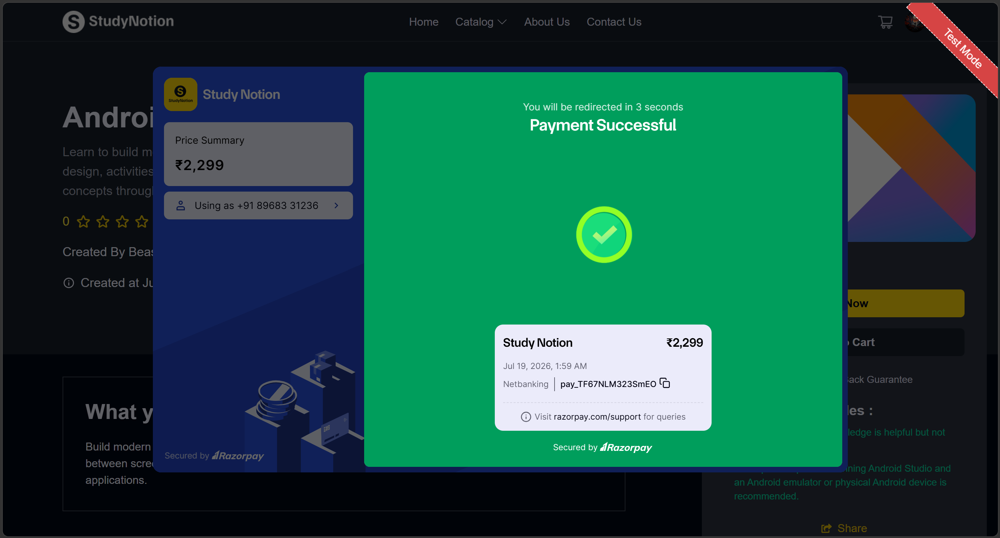

---

### Mobile Responsive Design

StudyNotion is fully responsive, providing a consistent learning experience across desktop, tablet, and mobile devices.


---

## Installation

Follow the steps below to set up StudyNotion locally.

### Prerequisites

Before you begin, ensure that the following software is installed on your system:

- Node.js (v18 or later)
- npm
- Git
- MongoDB (Local or MongoDB Atlas)

---

### Clone the Repository

```bash
git clone https://github.com/ArshnoorSingh07/StudyNotion.git
cd StudyNotion
```

---

### Install Dependencies

Install the required dependencies for both the frontend and backend.

#### Frontend

```bash
cd frontend
npm install
```

#### Backend

```bash
cd ../server
npm install
```

---

## Environment Variables

Create a `.env` file inside the `server` directory and configure the following environment variables.

```env
PORT=

MONGODB_URL=

JWT_SECRET=

JWT_EXPIRES_IN=

CLOUD_NAME=

API_KEY=

API_SECRET=

FOLDER_NAME=

MAIL_HOST=

MAIL_USER=

MAIL_PASS=

RAZORPAY_KEY=

RAZORPAY_SECRET=

FRONTEND_URL=
```

---

## Running the Application

Start the backend server.

```bash
cd server
npm run dev
```

Open a new terminal and start the frontend application.

```bash
cd frontend
npm start
```

After both services are running, open your browser and navigate to:

| Service | URL |
|---------|-----|
| Frontend | http://localhost:3000 |
| Backend | http://localhost:4000 |

---

## Deployment

The application is deployed using modern cloud services.

| Component | Platform |
|-----------|----------|
| Frontend | Vercel |
| Backend | Render |
| Database | MongoDB Atlas |
| Media Storage | Cloudinary |
| Payment Gateway | Razorpay |

---

## Future Enhancements

- Course completion certificates
- Quiz and assessment module
- Live classes and video conferencing
- Discussion forums
- Personalized course recommendations
- Instructor analytics
- In-app notifications
- Mobile application
- Admin dashboard
- Multi-language support

---

## License

This project is licensed under the MIT License. See the `LICENSE` file for more information.

---

## Author

**Arshnoor Singh**

- GitHub: https://github.com/ArshnoorSingh07
- LinkedIn: https://www.linkedin.com/in/arshnoor-singh1/
