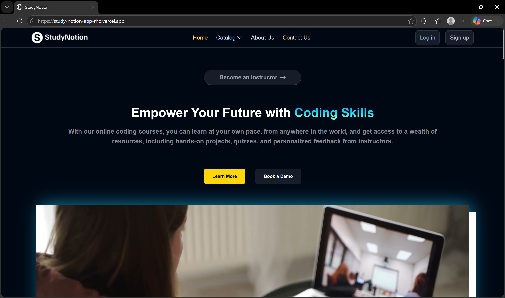
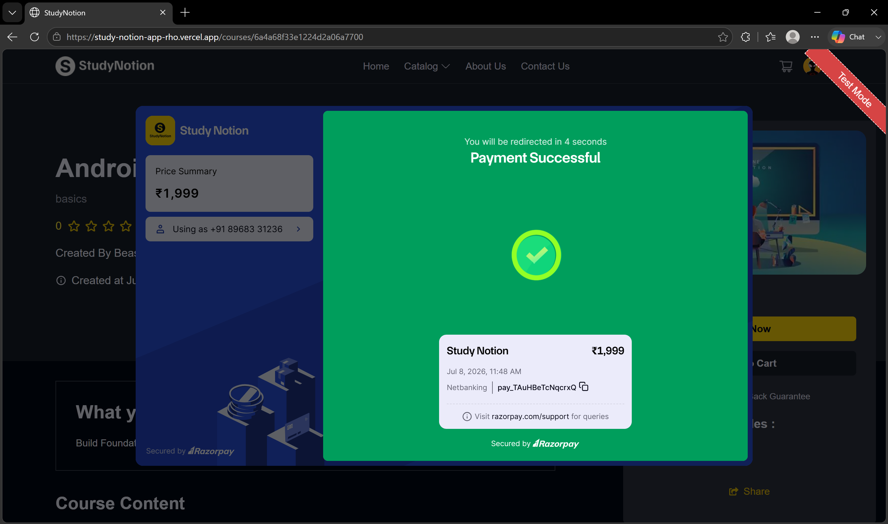

# StudyNotion

StudyNotion is a full-stack Learning Management System (LMS) built using the MERN stack. It enables instructors to create, manage, and publish courses while allowing students to discover, purchase, and learn through a secure, responsive, and interactive platform.

The application implements secure authentication, role-based authorization, online payment integration, cloud-based media management, RESTful APIs, and a modern React-based user interface.

## Live Demo

**Website:** https://study-notion-app-rho.vercel.app

## Features

### Authentication

- JWT-based Authentication
- Role-Based Access Control (Student & Instructor)
- Secure Login and Registration
- Password Reset via Email
- Protected Routes

### Student Module

- Browse Available Courses
- Purchase Courses using Razorpay
- Enroll in Courses
- Watch Video Lectures
- Track Learning Progress
- Submit Ratings and Reviews
- Update Profile Information

### Instructor Module

- Create, Update, Publish, and Delete Courses
- Upload Course Thumbnail
- Create Sections and Subsections
- Upload Lecture Videos
- Manage Course Content
- Instructor Dashboard

### Course Management

- Course Categories
- Tags
- Sections and Subsections
- Video Lectures
- Learning Progress
- Ratings and Reviews

### Payment Integration

- Razorpay Checkout
- Secure Payment Verification
- Automatic Course Enrollment

### Cloud Storage

- Cloudinary Image Upload
- Cloudinary Video Upload

---

## Tech Stack

### Frontend

- React.js
- Redux Toolkit
- React Router DOM
- Tailwind CSS

### Backend

- Node.js
- Express.js
- MongoDB
- Mongoose

### Authentication

- JSON Web Token (JWT)
- Bcrypt

### Third-Party Services

- Razorpay
- Cloudinary
- Nodemailer

---

## Project Architecture

```
                   React.js Frontend
                           │
                           ▼
                Express.js REST APIs
                           │
                           ▼
                 Business Logic Layer
                           │
                           ▼
                    MongoDB Database
                     │             │
                     ▼             ▼
              Cloudinary      Razorpay
```

---

## Screenshots

### Home Page



---

### Authentication

| Login | Signup |
|-------|--------|
|  |  |

---

### Instructor Dashboard


---

### Student Dashboard


---

### Course Details


---

### Payment Page




---

### Video Learning


---

## Folder Structure

```
StudyNotion
│
├── client
│   ├── public
│   ├── src
│   │   ├── assets
│   │   ├── components
│   │   ├── hooks
│   │   ├── pages
│   │   ├── redux
│   │   ├── services
│   │   ├── utils
│   │   └── App.jsx
│   └── package.json
│
├── server
│   ├── config
│   ├── controllers
│   ├── mail
│   ├── middleware
│   ├── models
│   ├── routes
│   ├── utils
│   ├── index.js
│   └── package.json
│
└── README.md
```

---

## Installation

Clone the repository

```bash
git clone https://github.com/ArshnoorSingh07/StudyNotion.git
```

Navigate to the project directory

```bash
cd StudyNotion
```

Install frontend dependencies

```bash
cd client
npm install
```

Install backend dependencies

```bash
cd ../server
npm install
```

---

## Environment Variables

Create a `.env` file inside the **server** directory.

```env
PORT=

MONGODB_URL=

JWT_SECRET=

MAIL_HOST=

MAIL_USER=

MAIL_PASS=

CLOUD_NAME=

API_KEY=

API_SECRET=

RAZORPAY_KEY=

RAZORPAY_SECRET=
```

---

## Running the Application

Start the backend server

```bash
npm run dev
```

Start the frontend

```bash
npm start
```

---

## Core Functionalities

- Secure JWT Authentication
- Role-Based Authorization
- Student and Instructor Dashboards
- Course Creation and Management
- Video Lecture Delivery
- Learning Progress Tracking
- Ratings and Reviews
- Razorpay Payment Integration
- Cloudinary Media Management
- Responsive User Interface
- RESTful API Architecture

---

## Future Enhancements

- Quiz and Assessment Module
- Course Certificates
- Discussion Forum
- Wishlist
- Live Classes
- Instructor Analytics
- AI-Based Course Recommendations

---

## Author

**Arshnoor Singh**

GitHub: https://github.com/ArshnoorSingh07

LinkedIn: https://www.linkedin.com/in/arshnoor-singh/

---

## License

This project is intended for educational purposes.