# StudyNotion

A full-stack MERN learning platform with a course-aware AI study companion. Instructors build and manage courses; students purchase access, watch lessons, track progress, and ask questions grounded in their course material.


## Table of Contents

- [Overview](#overview)
- [Key Highlights](#key-highlights)
- [Live Demo](#live-demo)
- [Technology Stack](#technology-stack)
- [Features](#features)
- [AI Study Companion](#ai-study-companion)
- [System Architecture](#system-architecture)
- [Project Structure](#project-structure)
- [Application Preview](#application-preview)
- [Installation](#installation)
- [Environment Variables](#environment-variables)
- [Running the Application](#running-the-application)
- [Testing](#testing)
- [Deployment](#deployment)
- [Future Enhancements](#future-enhancements)
- [License](#license)
- [Author](#author)

## Overview

StudyNotion combines course creation, paid enrollment, video learning, and an AI tutor in one application. The React frontend communicates with an Express API; MongoDB stores users, courses, progress, and conversations. Cloudinary handles media, Razorpay handles payments, Brevo delivers email, and Groq generates AI answers using relevant course passages.

## Key Highlights

- AI explanations, summaries, and practice questions with lesson references and streamed answers.
- JWT authentication, email OTP verification, and student/instructor access controls.
- Course ownership checks and instructor approval before publishing.
- Course builder with sections, video lectures, and instructor-provided lesson notes or transcripts.
- Razorpay checkout, Cloudinary media storage, and student progress tracking.
- Instructor analytics for enrollment and revenue.
- Responsive UI and lazy-loaded routes.
- Automated regression checks and an opt-in live MongoDB/Groq test.

## Live Demo

| Resource | URL |
|---|---|
| Frontend | https://study-notion-app-rho.vercel.app |
| Backend API | https://studynotion-backend-ojy2.onrender.com |
| Repository | https://github.com/ArshnoorSingh07/StudyNotion |

These are the project's deployment links. Local changes require deployment before they appear on the hosted application.

## Technology Stack

| Area | Technologies |
|---|---|
| Frontend | React 18, JavaScript, React Router, Redux Toolkit |
| Styling and UI | Tailwind CSS 3, PostCSS, Framer Motion, Lucide, React Icons |
| Forms and requests | React Hook Form, Axios, Fetch API |
| Charts and media UI | Chart.js, Swiper, Video React |
| Backend | Node.js, Express 5, REST APIs |
| Database | MongoDB, Mongoose 9 |
| Authentication | JSON Web Tokens, bcrypt, email OTP |
| AI | Groq Chat Completions, lexical RAG with BM25-style ranking, SSE streaming |
| AI response display | React Markdown |
| Media storage | Cloudinary |
| Payments | Razorpay |
| Email | Brevo transactional email API |
| Build and development | Create React App / react-scripts, nodemon, concurrently |
| Testing | Node.js test runner, ESLint, live integration script |
| Hosting | Vercel frontend, Render backend, MongoDB Atlas |

## Features

| Module | Functionality |
|---|---|
| Authentication | Registration, login, OTP verification, password reset, JWT authentication |
| Student dashboard | Enrolled courses, video lessons, progress tracking, profile management |
| Instructor dashboard | Course management, lesson uploads, enrollment and revenue analytics |
| Course builder | Categories, sections, lectures, thumbnails, lesson notes, drafts and publishing |
| AI study companion | Course questions, follow-ups, summaries, practice prompts, saved chats and source links |
| Payments | Razorpay checkout and enrollment after payment verification |
| Reviews | Ratings and reviews for enrolled courses |
| Access controls | Ownership checks, enrollment checks, instructor approval and AI usage limits |

Public signup accepts Student and Instructor accounts. New instructors can save drafts, but publishing requires their stored `approved` flag to be `true`. An administrator must manage that approval in the database; an approval dashboard is not implemented yet.

## AI Study Companion

The floating **Ask AI** button opens the study companion. Chat is available to active students enrolled in a published course. Instructors contribute material through **Lesson notes / transcript** in the lecture editor; instructor accounts cannot chat with the assistant.

### How it works

1. The backend verifies the student's account and course enrollment.
2. It splits current course descriptions and instructor notes into overlapping passages.
3. Lexical retrieval ranks passages using BM25-style word matching and selects up to five.
4. Groq receives the question, selected passages, and up to six prior messages.
5. The answer streams through server-sent events (SSE), with numbered citations and lesson links.

The default model is `openai/gpt-oss-20b`, configurable through `GROQ_MODEL`. New explicit topics are retrieved independently; vague follow-ups reuse the latest explicit topic.

### Scope and limits

- Uses written course material and instructor-provided transcripts; videos are not automatically transcribed or watched.
- Uses lexical retrieval; no embedding service or vector database is configured.
- Saved lesson edits and deletions affect subsequent retrieval. Summaries use selected excerpts and may not cover every lesson.
- History is stored per student/course, capped at 40 messages. MongoDB TTL cleanup removes sessions after approximately 30 days of inactivity.
- **New chat** clears the selected course's history. Session locks prevent overlapping answers for the same student/course.
- Database counters enforce 10 requests per minute and 100 per day in fixed time windows. Failed requests can count toward the limits.
- MongoDB must permit creation of the unique session and TTL indexes.
- Provider requests include course excerpts and chat context, without account credentials or private profile fields.
- Without `GROQ_API_KEY`, chat reports that the assistant is not configured. AI responses should still be checked against their sources.

## System Architecture

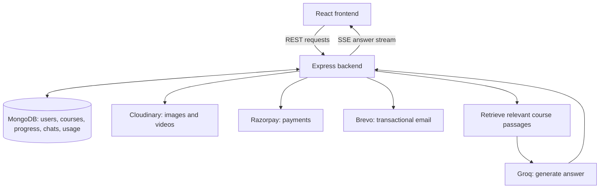
```mermaid
flowchart TD
    UI[React frontend] -->|REST requests| API[Express backend]
    API -->|SSE answer stream| UI
    API <--> DB[(MongoDB: users, courses, progress, chats, usage)]
    API --> Media[Cloudinary: images and videos]
    API --> Payments[Razorpay: payments]
    API --> Email[Brevo: transactional email]
    API --> Retrieval[Retrieve relevant course passages]
    Retrieval --> AI[Groq: generate answer]
    AI --> API
```

API credentials stay on the backend. The frontend receives the public Razorpay key ID and API base URL through its build-time environment variables.

## Project Structure

```text
StudyNotion/
|-- Frontend/
|   |-- public/
|   |-- scripts/              # CSS preparation for the CRA build
|   |-- src/
|   |   |-- assets/
|   |   |-- Components/      # Shared UI, dashboards, course builder, assistant
|   |   |-- data/
|   |   |-- hooks/
|   |   |-- pages/
|   |   |-- reducer/         # Combined Redux reducers
|   |   |-- slices/          # Redux state slices
|   |   |-- services/        # API endpoints and client operations
|   |   |-- styles/
|   |   |-- utils/
|   |   |-- App.js
|   |   `-- index.js
|   `-- package.json
|-- Server/
|   |-- config/
|   |-- controllers/
|   |-- middlewares/
|   |-- models/
|   |-- routes/
|   |-- services/ai/         # Retrieval and Groq client
|   |-- scripts/             # Opt-in live integration check
|   |-- tests/               # Regression tests
|   |-- utils/
|   |-- mail/
|   |-- index.js
|   `-- package.json
|-- screenshots/
|-- README.md
`-- package.json             # Run frontend/backend together
```

Directory names are case-sensitive on Linux: use `Frontend`, `Server`, and `Components` as shown.

## Application Preview

The following screenshots highlight the core features and user experience of StudyNotion.

### Landing Page

The landing page introduces the platform, featured courses, categories, and key functionalities.


---

### User Registration

New users can create an account with email verification using OTP authentication.

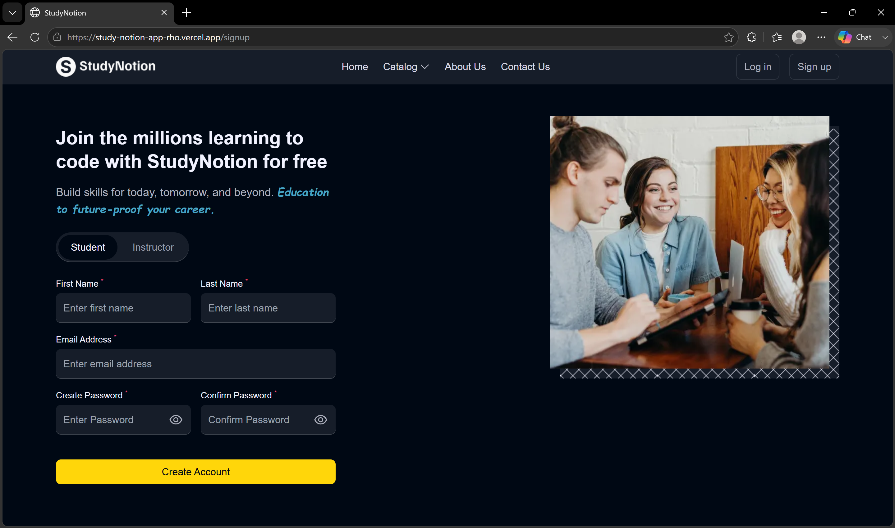

---

### User Login

Secure authentication using JWT-based login.

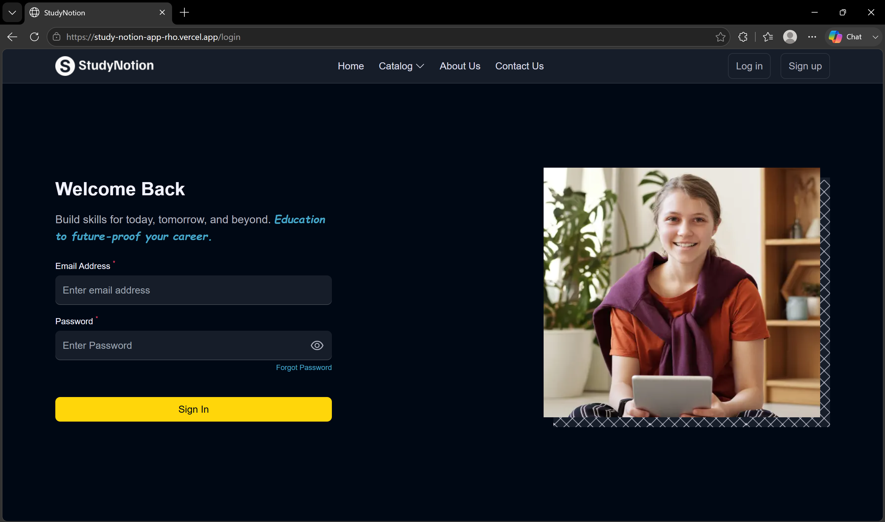

---

### Home Dashboard

Students can browse available courses, categories, and course information.

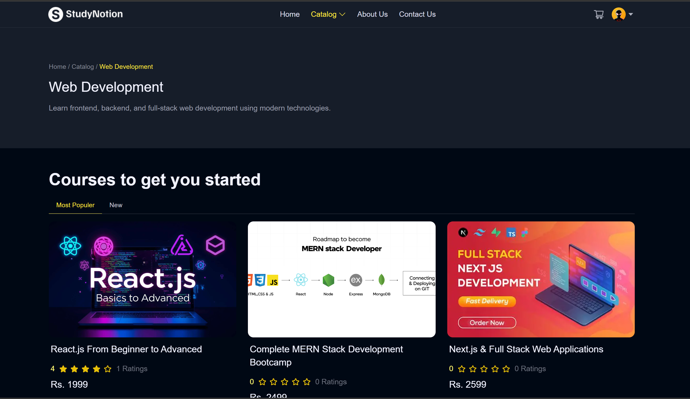

---

### Course Details

Detailed course information including instructor, curriculum, pricing, and reviews.

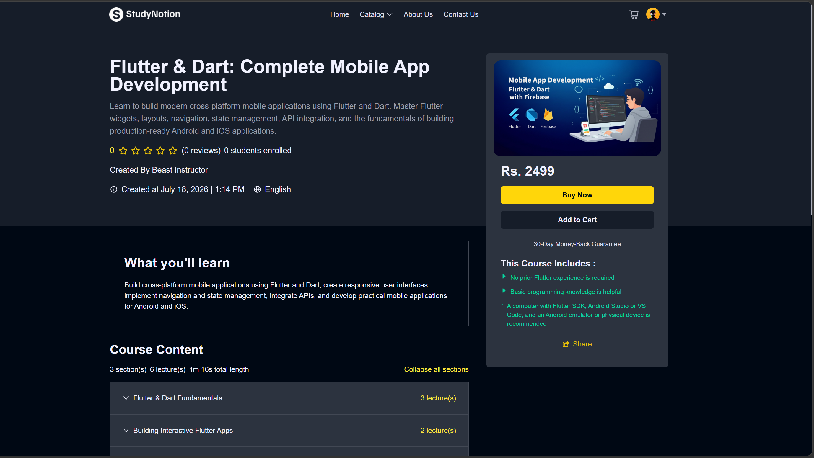

---

### Student Dashboard

Students can manage enrolled courses, learning progress, profile, and account settings.

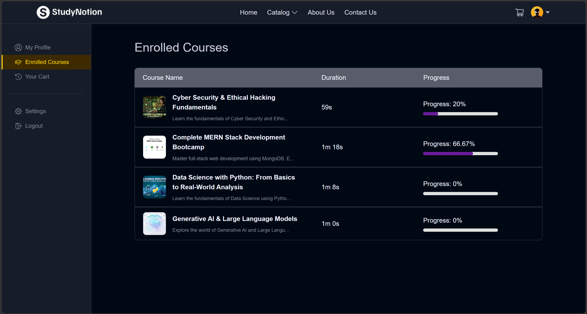

---

### Video Learning Experience

Interactive course player with lecture navigation and progress tracking.

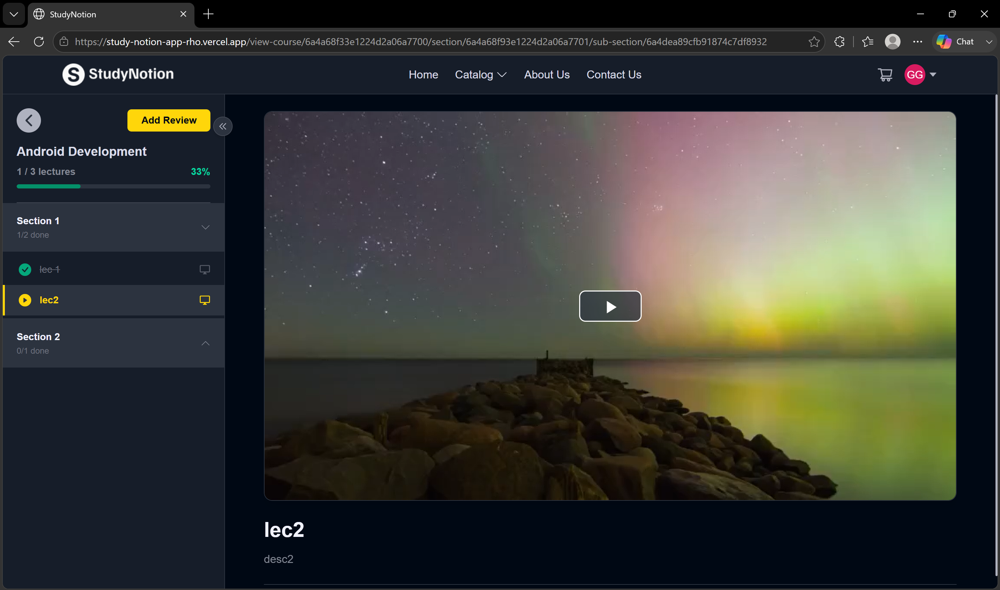

---

### Instructor Dashboard

Instructors can monitor published courses, enrolled students, and overall course performance.

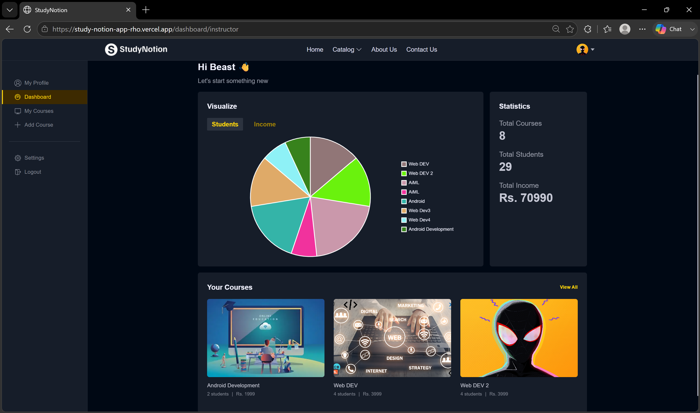

---

### Course Builder

A dedicated interface for creating and organizing courses with sections and lectures.

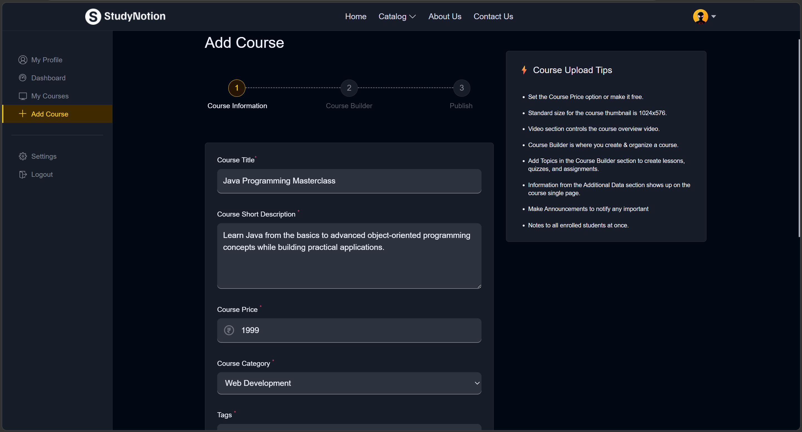

---

### Edit Course

Update course information, pricing, thumbnails, and publication status.

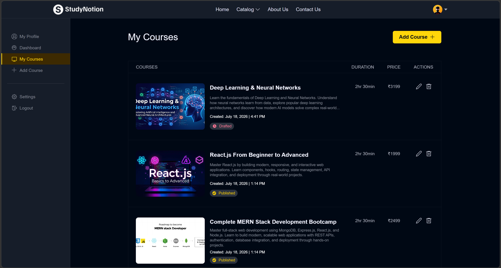
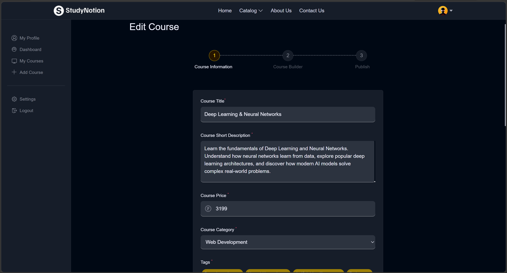

---

### Profile Management

Users can update personal information, profile picture, and account settings.

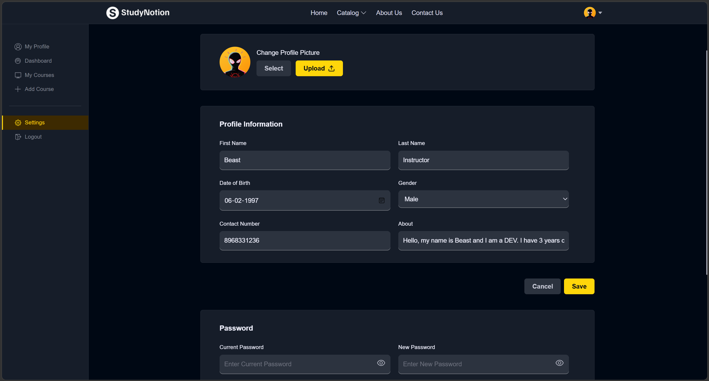

---

### Payment Integration

Secure checkout powered by Razorpay for seamless course enrollment.

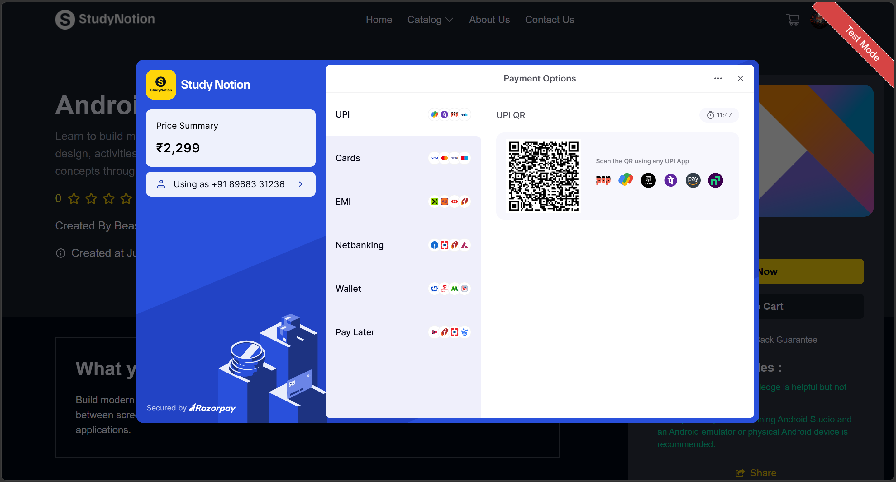
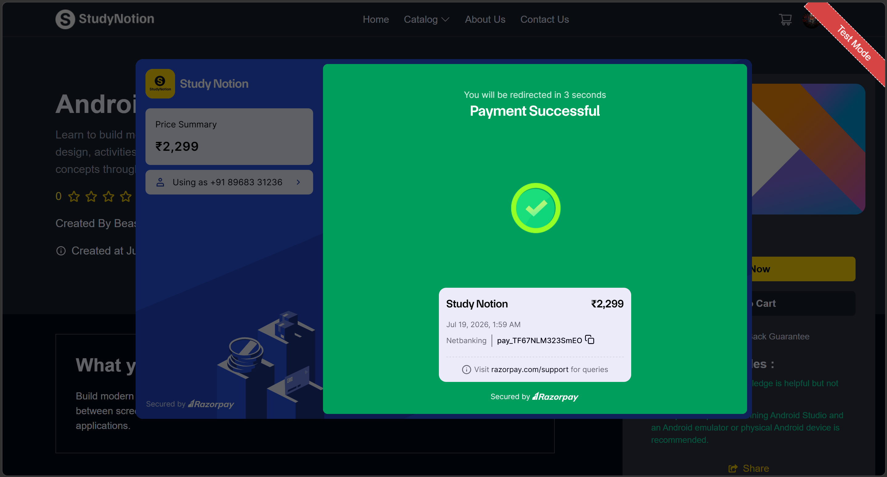

---

### Mobile Responsive Design

StudyNotion is fully responsive, providing a consistent learning experience across desktop, tablet, and mobile devices.

<p align="center">
  
</p>

---

## Installation

### Prerequisites

- Node.js **20.19.0 or newer**, as required by the installed Mongoose version.
- npm and Git.
- MongoDB locally or on Atlas, with a connection URL and network access from the backend.
- Cloudinary, Razorpay, and Brevo credentials for media, payments, and email verification.
- A Groq API key to enable the study companion.

### Clone and install

```bash
git clone https://github.com/ArshnoorSingh07/StudyNotion.git
cd StudyNotion
npm install
cd Frontend
npm install --legacy-peer-deps
cd ../Server
npm install
cd ..
```

Install the root dependencies as well as both applications. The frontend uses `--legacy-peer-deps` because some older UI packages declare peer dependencies that conflict with the React version used here.

## Environment Variables

The examples below contain placeholders. Replace them with your own settings and keep real credentials out of source control.

### Backend: `Server/.env`

```env
PORT=4000
MONGODB_URL=mongodb://127.0.0.1:27017/studynotion
JWT_SECRET=replace_with_a_long_random_secret
FRONTEND_URL=http://localhost:3000

# Cloudinary
CLOUD_NAME=your_cloud_name
API_KEY=your_cloudinary_api_key
API_SECRET=your_cloudinary_api_secret
FOLDER_NAME=StudyNotion

# Brevo: use a verified sender
BREVO_API_KEY=your_brevo_api_key
BREVO_SENDER_NAME=StudyNotion
BREVO_SENDER_EMAIL=your_verified_sender@example.com

# Razorpay: use matching test credentials for local development
RAZORPAY_KEY=your_razorpay_key_id
RAZORPAY_SECRET=your_razorpay_secret

# Optional: enables the AI study companion
GROQ_API_KEY=your_groq_api_key
GROQ_MODEL=openai/gpt-oss-20b
```

Replace the local MongoDB URL with your Atlas connection string when using Atlas. The implementation sends email through Brevo; SMTP `MAIL_*` variables are not used. JWT lifetime is currently set in the authentication controller rather than through `JWT_EXPIRES_IN`.

### Frontend: `Frontend/.env`

```env
REACT_APP_BASE_URL=http://localhost:4000/api/v1
REACT_APP_RAZORPAY_KEY=your_razorpay_key_id
```

Use the same Razorpay key ID as the backend. Do not include a trailing slash in `REACT_APP_BASE_URL`. Frontend environment values are included in the browser bundle, so server secrets and the Groq key belong only in `Server/.env`.

Restart development processes after changing environment variables; deployed frontend changes require rebuilding.

## Running the Application

From the repository root, start both services:

```bash
npm run dev
```

Or use two terminals, each starting in the repository root:

```bash
# Terminal 1
npm --prefix Server run dev
```

```bash
# Terminal 2
npm --prefix Frontend start
```

| Service | Local URL |
|---|---|
| Frontend | http://localhost:3000 |
| Backend health response | http://localhost:4000/ |
| API base | http://localhost:4000/api/v1 |

## Testing

Run these commands from the repository root:

| Command | Purpose |
|---|---|
| `npm test` | Backend regression suite: retrieval, assistant behavior, signup, ownership and publishing |
| `npm --prefix Server run test:assistant` | Assistant regression tests only |
| `npm --prefix Frontend run lint` | Frontend ESLint checks |
| `npm --prefix Frontend run build` | Production frontend build, including CSS preparation |
| `npm --prefix Server run test:live` | Opt-in real MongoDB and Groq integration checks |

Regression tests use test doubles and do not require a live MongoDB connection or Groq request. The live check reads `Server/.env` and requires `MONGODB_URL`, `JWT_SECRET`, and `GROQ_API_KEY`.

### Live integration checks

The live script creates a randomly named `sn_live_*` database on the configured MongoDB cluster, starts an HTTP server on a temporary loopback port, and exercises the actual routes and models. A successful run makes two real Groq requests, which can consume provider quota or incur charges. The MongoDB user needs permission to create indexes and create/drop the temporary database.

Coverage includes authentication, enrollment, course ownership, publishing approval, streamed answers, citations, follow-ups, persisted history, unsupported questions, private-note filtering, session locks, revoked access, daily quotas, and chat clearing.

Existing application records are not modified. The script drops its temporary database and verifies cleanup before reporting success. If interrupted or cleanup fails, inspect the reported temporary database name. These checks cover backend flows; they do not test browser interactions, live email delivery, media uploads, or payment checkout.

## Deployment

| Component | Platform |
|---|---|
| Frontend | Vercel |
| Backend | Render |
| Database | MongoDB Atlas |
| Media storage | Cloudinary |
| Payments | Razorpay |
| Email | Brevo |
| AI inference | Groq |

- Build the frontend from `Frontend` with `npm run build`; the output directory is `build`. Configure frontend environment variables before building and provide SPA fallback routing to `index.html`.
- Start the backend from `Server` with `npm start`. Configure its environment variables on the host, using the deployed frontend origin for `FRONTEND_URL`.
- Set the frontend API base URL to the deployed backend URL ending in `/api/v1`.
- Allow the backend to reach MongoDB and the external APIs. Preserve SSE streaming through any proxy so AI answers arrive incrementally.

## Future Enhancements

- Course completion certificates.
- Graded quizzes and assessments beyond AI-generated practice prompts.
- Live classes and discussion forums.
- Personalized course recommendations.
- In-app notifications and a mobile application.
- Admin dashboard with instructor approval controls.
- Semantic vector retrieval and document ingestion.
- Automatic lecture transcription.
- Multi-language support.

## License

The root and backend package manifests declare ISC, but this repository does not currently include a standalone `LICENSE` file. The earlier MIT statement was inconsistent with those manifests; a license file still needs to be added by the project owner.

## Author

**Arshnoor Singh**

- GitHub: https://github.com/ArshnoorSingh07
- LinkedIn: https://www.linkedin.com/in/arshnoor-singh1/
